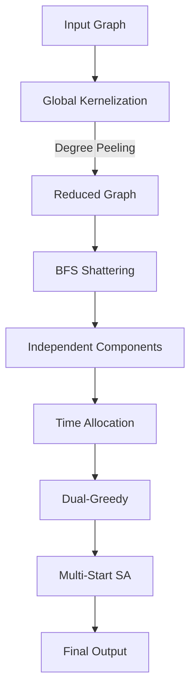

# Maximum Weight Independent Set (MWIS) Metaheuristic Solver

[](https://isocpp.org/)

This repository contains a highly optimized C++ solver (`mwis_enhanced_sa.cpp`) for the **Maximum Weight Independent Set (MWIS)** problem. It is engineered to find high-quality approximate solutions within a strict time limit (e.g. 5 minutes) on massive graphs containing up to 200,000 nodes and 200,000 edges.

The solver combines **Deep Kernelization**, **Dual-Greedy Baselines**, and a **Multi-Start Simulated Annealing (SA)** engine featuring dynamic neighborhood exploration.

---

## Table of Contents
1. [The Problem: What is MWIS?](#1-the-problem-what-is-mwis)
2. [Real-World Applications](#2-real-world-applications)
3. [Algorithm Pipeline](#3-algorithm-pipeline)
4. [Phase 1: Deep Kernelization](#4-phase-1-deep-kernelization)
5. [Phase 2: Component Time Management](#5-phase-2-component-time-management)
6. [Phase 3: The Heuristic Engine](#6-phase-3-the-heuristic-engine)
7. [Limitations](#7-limitations)
8. [Repository Structure](#8-repository-structure)
9. [Input & Output Format](#9-input--output-format)
10. [Sample Run](#10-sample-run)
11. [Benchmarks](#11-benchmarks)
12. [Getting Started](#12-getting-started)

---

## 1. The Problem: What is MWIS?

In graph theory, an **Independent Set** is a subset of nodes where no two nodes are connected by an edge. In **MWIS**, each node has a "weight." 

The goal is to select a subset of nodes such that:
1. **Zero Conflicts:** No two selected nodes share an edge.
2. **Maximum Weight:** The total sum of the chosen nodes' weights is maximized.

MWIS is **NP-Hard**. Finding the exact mathematical optimum for massive graphs in polynomial time is not feasible, so this solver utilizes advanced heuristics to efficiently navigate the search space.

---

## 2. Real-World Applications

MWIS is a foundational framework for resolving mutually exclusive constraints:
*   **Advertisement Selection:** Displaying the most profitable set of ads without violating competitor exclusivity agreements (Node = Advertisement, Weight = Expected revenue, Edge = Competitor conflict).
*   **Telecommunications:** Assigning non-interfering frequency channels to cell towers (Node = Tower, Weight = Customers, Edge = Signal jam).
*   **Course Scheduling:** Scheduling the most high-value exams without any student experiencing overlapping times (Node = Exam, Weight = Enrolled students, Edge = Time-table overlap).
*   **Social Network Influencers:** Sponsoring a group of influencers to maximize reach without paying for overlapping/redundant audiences (Node = Influencer, Weight = Expected influence, Edge = Redundant audience).
*   **Job Scheduling:** Selecting the most profitable combination of computational tasks on a server without overlapping intervals (Node = Task, Weight = Profit, Edge = Overlapping timeframe).

---

## 3. Algorithm Pipeline



---

## 4. Phase 1: Deep Kernelization

Before applying heuristics, we use rigorous math to safely shrink the graph. These "peeling" rules never lower the optimal score.
*   **Degree-0 Isolation:** If a node has no edges, add it to the team immediately (free weight).
*   **Degree-1 Domination:** If Node U has only one neighbor (Node V), and Weight(U) >= Weight(V), we permanently add U to the team and discard V.
*   **Degree-2 Path Folding:** If Node U has exactly two neighbors (V and W), and Weight(U) >= Weight(V) + Weight(W), picking U mathematically dominates picking any combination of V and W. Add U, discard V and W.

---

## 5. Phase 2: Component Time Management

Kernelization typically shatters the graph into multiple disconnected "islands" (components). Because they share no edges, we optimize them independently.

### Proportional Time Allocation Formula
To ensure the solver terminates gracefully within the 5-minute (295 seconds) global limit, time is allocated proportionally based on component size:

T_comp = T_rem * (N_comp / N_active)

*   **T_comp**: Time allocated to the current component.
*   **T_rem**: Remaining time on the global 5-minute clock.
*   **N_comp**: Number of nodes in this specific component.
*   **N_active**: Total number of nodes left to process across all remaining components.

---

## 6. Phase 3: The Heuristic Engine

For each component, the engine runs an intense search loop bounded by T_comp.

### The Safety Net (Dual-Greedy)
Standard greedy heuristics fall into "Star Graph" traps (picking a massive hub and losing thousands of smaller nodes). To prevent this, the solver generates two baselines:
1.  **Forward Greedy:** Builds from an empty set using the ratio `Weight / (Degree + 1)`.
2.  **Reverse Greedy:** Starts with all nodes and kicks out the worst (lowest ratio) until valid.
The engine proceeds using the maximum score of the two.

### "Drop & Greedy Repair"
Standard SA struggles because it only attempts 1-flip mutations. Our engine uses a dynamic k-swap. When dropping Node U, it instantly scans the resulting hole and greedily stuffs non-conflicting neighbors into it. This allows the algorithm to tunnel through deep local minima in a single step.

### Multi-Start Epochs
To avoid getting stuck on a single local mountain, the SA engine cools rapidly in 3-second "Epochs." Once cooled, it saves the peak, wipes the team, and generates a new randomized starting state (GRASP) to explore a completely different area of the graph.

---

## 7. Limitations

*   **Heuristic Nature:** While highly effective, this solver guarantees a *near-optimal* approximation, not the mathematical maximum. For extremely small graphs (N < 40), an exact Branch-and-Bound solver would guarantee the perfect solution.
*   **Dense Graphs:** Performance scales exceptionally well on sparse, tree, and grid structures. On extraordinarily dense graphs (e.g., cliques), the local search can experience slower convergence rates.

---

## 8. Repository Structure

```text
mwis-metaheuristic-solver/
│
├── src/
│   └── mwis_enhanced_sa.cpp    # The core solver engine
├── test_suite/                 # Sample input/output graphs
│   ├── input_01_tiny.txt
│   └── ...
└── README.md                   # Documentation
```

---

## 9. Input & Output Format

### Input Format
The program accepts text files formatted as follows:
*   **Line 1:** `N` (number of nodes) and `M` (number of edges).
*   **Line 2:** `N` space-separated integers representing the weight of each node.
*   **Line 3:** `M` lines each contain two integers: `u` and `v`, indicating a mutual conflict between `u` and  `v` (1-based indexing).

### Output File Logic
If you pass the input file as a command-line argument, the solver will automatically extract the filename, replace the word `input` with `output` , and save the results securely to your current directory. 
The output file contains:
*   **Line 1:** The total Maximum Weight score found.
*   **Line 2:** A space-separated list of the selected node indices (1-based).

---

## 10. Sample Run

**input_sample.txt**
```text
4 3
10 20 30 40
1 2
2 3
3 4
```
*(This is a line graph: 1-2-3-4)*

**Execution:**
```bash
./mwis_solver input_sample.txt
```

**output_sample.txt**
```text
60
2 4
```
*(Nodes 2 and 4 are selected, giving 20 + 40 = 60)*

---

## 11. Benchmarks

Testing on various massive topological datasets from the test suite:

| Dataset | Nodes (N) | Edges (M) | Topology | Result Score | 
| :--- | :--- | :--- | :--- | :--- |
| `input_03_path_n500.txt` | 500 | 499 | Long Path | 146,289,083,148 | 
| `input_10_grid_25x40_n1000.txt` | 1,000 | 1,935 | 2D Grid | 263,886,987,500 |
| `input_legacy_5.txt` | 100,000 | 99,999 | Star Trap | 1,099,989 |
| `input_17_large_sparse_n100000_m200000.txt` | 100,000 | 200,000 | Random Sparse | 27,045,918,905,545 | 
| `input_18_max_edges_sparse_n200000_m200000.txt` | 200,000 | 200,000 | Maximum Sparse | 67,086,115,653,449 |

*Runtime: All datasets finish computing well within the 5-minute constraint, efficiently breaking down large graphs using kernelization prior to heuristic search.*

---

## 12. Getting Started

Compile the solver with maximum optimizations, utilizing loop unrolling and modern CPU instruction sets.

```bash
g++ -O3 -funroll-loops -march=native mwis_enhanced_sa.cpp -o mwis_solver
```

Run the solver by passing the input file:
```bash
./mwis_solver test_suite/input_01_tiny_random.txt
```