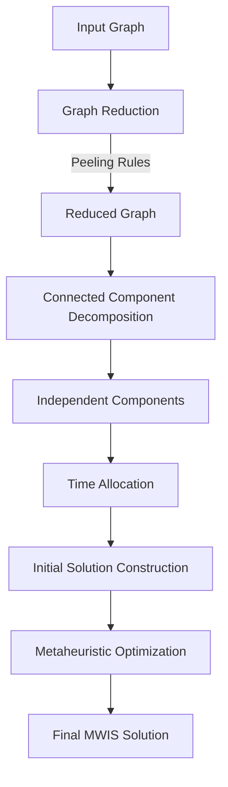

# Maximum Weight Independent Set (MWIS) Metaheuristic Solver

[](https://isocpp.org/)

This repository contains a collection of heuristic and metaheuristic algorithms for solving the **Maximum Weight Independent Set (MWIS)** problem. Developed as an individual project, it explores the evolution of increasingly advanced solver designs, starting from basic Simulated Annealing and progressing to graph reduction techniques, component-based optimization, GRASP initialization, Tabu Search, Iterated Local Search, and OpenMP-parallelized implementations.

The project emphasizes scalable optimization for large graphs by combining efficient preprocessing, high-quality initialization strategies, and time-bounded local search frameworks.

---

## Table of Contents
1. [The Problem: What is MWIS?](#1-the-problem-what-is-mwis)
2. [Real-World Applications](#2-real-world-applications)
3. [Core Techniques](#3-core-techniques)
4. [Algorithm Pipeline](#4-algorithm-pipeline)
5. [Algorithm Evolution](#5-algorithm-evolution)
6. [Complexity Discussion](#6-complexity-discussion)
7. [Algorithm Comparison Table](#7-algorithm-comparison-table)
8. [Repository Structure](#8-repository-structure)
9. [Input & Output Format](#9-input--output-format)
10. [Benchmarking Infrastructure](#10-benchmarking-infrastructure)
11. [Benchmark Results](#11-benchmark-results)
12. [Lessons Learned](#12-lessons-learned)
13. [Getting Started](#13-getting-started)
14. [Sample Run](#14-sample-run)

---

## 1. The Problem: What is MWIS?

Given an undirected graph **G = (V, E)** and a non-negative weight `w(v)` associated with each vertex `v ∈ V`, the **Maximum Weight Independent Set (MWIS)** problem seeks an independent set **S ⊆ V** that maximizes the total weight:

**Weight(S) = Σ w(v), for all v ∈ S**

An **independent set** is a subset of vertices in which no two selected vertices are adjacent. In other words, for every pair of vertices `u, v ∈ S`, the edge `(u, v)` must not belong to `E`.

The objective is therefore:

1. Select a subset of vertices that contains no adjacent vertices.
2. Maximize the sum of their weights.

MWIS is a classical combinatorial optimization problem and is NP-hard on general graphs.

---

## 2. Real-World Applications
The MWIS problem serves as a foundational model for numerous real-world optimization challenges, including:
*   **Advertisement Selection:** Displaying the most profitable set of ads without violating competitor exclusivity agreements (Node = Advertisement, Weight = Expected revenue, Edge = Competitor conflict).
*   **Telecommunications:** Assigning non-interfering frequency channels to cell towers (Node = Tower, Weight = Customers, Edge = Signal jam).
*   **Course Scheduling:** Scheduling the most high-value exams without any student experiencing overlapping times (Node = Exam, Weight = Enrolled students, Edge = Time-table overlap).
*   **Social Network Influencers:** Sponsoring a group of influencers to maximize reach without paying for overlapping/redundant audiences (Node = Influencer, Weight = Expected influence, Edge = Redundant audience).
*   **Job Scheduling:** Selecting the most profitable combination of computational tasks on a server without overlapping intervals (Node = Task, Weight = Profit, Edge = Overlapping timeframe).

---

## 3. Core Techniques

### Graph Reductions

Before optimization begins, simple reduction rules are applied to remove or simplify parts of the graph that can be handled deterministically. These reductions shrink the search space and allow more time to be spent on the difficult portions of the graph.

### Connected Component Decomposition

The graph is divided into independent connected components using Breadth-First Search (BFS). Since components do not interact, each can be optimized separately and their solutions can be combined to obtain a solution for the entire graph.

### Greedy Construction Heuristics

Greedy methods are used to quickly generate good initial solutions that serve as starting points for later optimization.

### Weight / (Degree + 1)

A scoring function that favors vertices with high weight and relatively few neighbors.

### Weight / √(Degree + 1)

A modified scoring function that reduces the penalty on high-degree vertices, allowing important heavy vertices to be selected more often.

### Forward Greedy

Starts with an empty independent set and repeatedly adds the highest-scoring feasible vertex until no more vertices can be added.

### Reverse Greedy

Starts from a dense candidate solution and progressively removes less promising vertices until a valid independent set is obtained.

### GRASP Initialization

Greedy Randomized Adaptive Search Procedure (GRASP). Randomness is added to the greedy selection process to generate diverse starting solutions across multiple runs.

### Simulated Annealing

A stochastic local search method that occasionally accepts worsening moves, helping the search escape local optima and explore new regions of the solution space.

### Tabu Search

A memory-based search strategy that temporarily forbids recently performed moves, reducing cycling and encouraging exploration.

### Iterated Local Search (ILS)

A framework that alternates between local optimization and controlled perturbations, allowing the search to escape local optima and continue improving.

### Drop-and-Repair

A neighborhood operator that removes a selected vertex and then attempts to improve the solution by adding newly feasible vertices.

### Force-Add-and-Repair

A neighborhood operator that forces a vertex into the solution, removes conflicting vertices, and then repairs the solution by greedily adding feasible vertices.

### OpenMP Parallelization

Parallel versions solve multiple connected components simultaneously using OpenMP, improving CPU utilization and reducing overall runtime on multi-core systems.

---

## 4. Algorithm Pipeline


---

## 5. Algorithm Evolution

The project was developed incrementally, with each solver addressing limitations observed in the previous generation. Rather than jumping directly to a complex metaheuristic, the focus was on understanding which improvements produced measurable gains in solution quality, scalability, and runtime efficiency.

### Stage 1: Basic Simulated Annealing

**Files:** `mwis_1_flip_sa.cpp`, `mwis_sqrt_1_flip_sa.cpp`

The first solvers established a baseline using greedy construction followed by 1-Flip Simulated Annealing.

Key features:

- Degree-0 preprocessing (isolated vertices are selected immediately).
- Greedy initialization.
- Feasible independent sets maintained throughout the search.
- Single-node add/remove neighborhood.
- Simulated Annealing acceptance criterion.

The two variants differ only in the greedy scoring function:

| Solver | Greedy Score |
|----------|-------------|
| `mwis_1_flip_sa.cpp` | `weight / (degree + 1)` |
| `mwis_sqrt_1_flip_sa.cpp` | `weight / sqrt(degree + 1)` |

The square-root version penalizes high-degree vertices less aggressively and often preserves heavy vertices that would otherwise be rejected by the standard density metric.


### Stage 2: Graph Peeling and Component Decomposition

**File:** `hackathon_peel1.cpp`

The next step focused on reducing the graph before optimization.

New additions:

- Degree-0 reduction.
- Degree-1 domination reduction.
- Connected-component decomposition using BFS.
- Component-wise time allocation.
- Dual-greedy initialization:
  - `weight / (degree + 1)`
  - `weight / sqrt(degree + 1)`

Each connected component is solved independently and the resulting solutions are merged to obtain the final MWIS.

This significantly reduces the effective search space while preserving solution quality.

---

### Stage 3: Enhanced Peeling

**File:** `hackathon_peel2.cpp`

This version extends the reduction framework with Degree-2 reductions.

New additions:

- Degree-2 folding-inspired reduction.
- More aggressive graph simplification.
- Smaller residual search space.
- Improved component-level optimization.

By eliminating additional low-degree structures before local search begins, the solver can dedicate more runtime to the difficult core of the graph.

---

### Stage 4: Enhanced Simulated Annealing

**File:** `mwis_enhanced_sa.cpp`

This release introduced the first major redesign of the search process.

New additions:

#### Multiple Initialization Strategies

- Forward Greedy
- Reverse Greedy
- Randomized GRASP-style Greedy

Forward Greedy constructs a solution from an empty set, while Reverse Greedy begins with all vertices and removes conflicts. Reverse Greedy performs particularly well on structures where traditional greedy methods struggle.

#### Advanced Neighborhoods

- Drop-and-Repair
- Force-Add-and-Repair

These neighborhoods perform larger structural modifications than simple 1-flip moves, enabling deeper exploration of the search space.

#### Multi-Start Simulated Annealing

The solver repeatedly generates diverse starting solutions and applies Simulated Annealing from each one, improving robustness and diversification.

This version became the strongest Simulated Annealing framework in the project.

---

### Stage 5: Tabu-Augmented Simulated Annealing

**File:** `mwis_tabu.cpp`

Although Enhanced SA produced strong results, search trajectories occasionally cycled through similar configurations.

To address this issue, a Tabu memory mechanism was introduced.

New additions:

- Tabu lock structure.
- Adaptive tabu tenure.
- Prevention of immediate move reversal.
- Hybrid Tabu Search + Simulated Annealing framework.

The Tabu mechanism forces exploration of new regions of the search space while Simulated Annealing continues to provide probabilistic escape from local optima.

This hybrid approach improved diversification and reduced stagnation.

---

### Stage 6: GRASP + Iterated Local Search (ILS)

**File:** `mwis_ils_grasp.cpp`

This solver explores an alternative philosophy to Simulated Annealing.

Instead of accepting worsening moves probabilistically, it follows a strict hill-climbing strategy combined with periodic perturbations.

New additions:

- GRASP initialization.
- Iterated Local Search (ILS).
- Hill-climbing local optimization.
- Perturbation kicks.
- Drop-and-Repair neighborhoods.
- Force-Add-and-Repair neighborhoods.

When progress stalls, a small portion of the current solution is removed and the search is restarted from the perturbed state.

This creates a clear separation between:

- **Intensification:** aggressive local improvement.
- **Diversification:** controlled perturbation and restart.

The resulting solver provides a strong alternative to Simulated Annealing-based approaches.


### Stage 7: Parallel Solvers

**Files:**

- `mwis_enhanced_sa_parallel.cpp`
- `mwis_tabu_parallel.cpp`
- `mwis_ils_grasp_parallel.cpp`

The final stage focused on scalability rather than introducing new optimization techniques.

All three parallel solvers preserve the logic of their sequential counterparts while exploiting modern multi-core processors through OpenMP.

Key additions:

- OpenMP parallelization.
- Component-level concurrency.
- Dynamic workload scheduling.
- Thread-local random number generators.
- Improved CPU utilization on large graphs.

Because connected components are independent, they can be solved simultaneously with minimal synchronization overhead.

This approach achieves substantial reductions in wall-clock runtime while maintaining the same search behavior and solution quality as the sequential versions.

---

### Summary of Evolution

| Stage | Main Improvement |
|---------|----------------|
| Stage 1 | Basic Greedy + 1-Flip Simulated Annealing |
| Stage 2 | Degree-0/1 Reductions + Component Decomposition |
| Stage 3 | Degree-2 Reductions |
| Stage 4 | Multi-Start SA + Reverse Greedy + GRASP + Advanced Neighborhoods |
| Stage 5 | Tabu-Augmented Simulated Annealing |
| Stage 6 | GRASP + Iterated Local Search |
| Stage 7 | OpenMP Parallelization |

---

## 6. Complexity Discussion

The Maximum Weight Independent Set (MWIS) problem is NP-hard, so no polynomial-time algorithm is known for finding optimal solutions on general graphs. Exact algorithms typically require exponential time in the worst case, making them impractical for the large benchmark instances considered in this project.

Our approach is therefore heuristic-based. The preprocessing phase, consisting of graph reductions and connected-component decomposition, runs in polynomial time and is dominated by graph traversal operations, giving a complexity of approximately **O(V + E)**.

The optimization phase uses metaheuristic search methods such as Simulated Annealing, Tabu Search, and Iterated Local Search. Since these algorithms are executed under a fixed wall-clock time limit, their practical runtime is bounded by the allocated time budget rather than by a predefined iteration count.

This design combines fast graph simplification with time-bounded local search, enabling the solver to scale to large instances while producing high-quality solutions within the competition time constraints.

---

## 7. Algorithm Comparison

| Version | Reductions | Initialization | Search Strategy | Component Decomposition | Parallelization |
|----------|------------|---------------|----------------|-------------------------|----------------|
| `mwis_1_flip_sa` | Degree-0 | `w/(d+1)` Greedy | 1-Flip Simulated Annealing | No | No |
| `mwis_sqrt_1_flip_sa` | Degree-0 | `w/sqrt(d+1)` Greedy | 1-Flip Simulated Annealing | No | No |
| `hackathon_peel1` | Degree-0, 1 | Dual Greedy | Component-wise Simulated Annealing | Yes | No |
| `hackathon_peel2` | Degree-0, 1, 2 | Dual Greedy | Component-wise Simulated Annealing | Yes | No |
| `mwis_enhanced_sa` | Degree-0, 1, 2 | Forward + Reverse + GRASP | Multi-Start Simulated Annealing | Yes | No |
| `mwis_tabu` | Degree-0, 1, 2 | Forward + Reverse + GRASP | Tabu-Augmented Simulated Annealing | Yes | No |
| `mwis_ils_grasp` | Degree-0, 1, 2 | Forward + Reverse + GRASP | GRASP + Iterated Local Search | Yes | No |
| `mwis_*_parallel` | Degree-0, 1, 2 | Forward + Reverse + GRASP | Same as Sequential Version | Yes | OpenMP |

---

## 8. Repository Structure

```text
.
├── src/
│   ├── mwis_1_flip_sa.cpp
│   ├── mwis_sqrt_1_flip_sa.cpp
│   ├── hackathon_peel1.cpp
│   ├── hackathon_peel2.cpp
│   ├── mwis_enhanced_sa.cpp
│   ├── mwis_tabu.cpp
│   ├── mwis_ils_grasp.cpp
│   ├── mwis_enhanced_sa_parallel.cpp
│   ├── mwis_tabu_parallel.cpp
│   └── mwis_ils_grasp_parallel.cpp
│
├── test_suite/
│   ├── inputs/
│   └── outputs/
│
├── evaluation_reports/
│   ├── evaluation_report1.txt
│   ├── evaluation_report2.txt
│   ├── evaluation_report3.txt
│   ├── evaluation_report_normal.txt
│   ├── evaluation_report_parallel.txt
│   └── final_analysis.md
│
└── README.md
```

---

## 9. Input & Output Format

### Input Format
The program accepts text files formatted as follows:
*   **Line 1:** `N` (number of nodes) and `M` (number of edges).
*   **Line 2:** `N` space-separated integers representing the weight of each node.
*   **Line 3 to M+2:** `M` lines each contain two integers: `u` and `v`, indicating a mutual conflict between node `u` and node `v` (1-based indexing).

### Output File Logic
If you pass the input file as a command-line argument, the solver will automatically extract the filename, replace the word `input` with `output` (or append `.out`), and save the results securely to your current directory. 
The output file contains:
*   **Line 1:** The total Maximum Weight score found.
*   **Line 2:** A space-separated list of the selected node indices (1-based).

---

## 10. Benchmarking Infrastructure

The repository includes a dedicated benchmarking framework for evaluating solver correctness, solution quality, and runtime performance.

- `test_suite/inputs/` — Collection of benchmark graph instances used for testing and evaluation.
- `test_suite/outputs/` — Generated solver outputs used for validation and result analysis.
- `evaluation_reports/` — Benchmarking reports containing performance comparisons across solver generations, including solution quality, runtime behavior, and parallel scalability.
- `src/` — Complete implementations of all sequential and parallel MWIS solvers developed throughout the project.

The benchmarking workflow verifies that every reported solution is a valid independent set and enables consistent comparison between different algorithmic approaches.

---

## 11. Benchmark Results

The solvers were evaluated on a diverse benchmark suite containing random graphs, paths, cycles, trees, grids, bipartite graphs, dense graphs, and large sparse graphs with up to 200,000 vertices.

### Sequential Solver Ranking

| Rank | Solver | Max Scores Hit |
|------|---------|----------------|
| 1 | `mwis_enhanced_sa` | 21 |
| 2 | `mwis_tabu` | 21 |
| 3 | `mwis_ils_grasp` | 20 |
| 4 | `hackathon_peel2` | 19 |

### Parallel Solver Ranking

| Rank | Solver | Max Scores Hit |
|------|---------|----------------|
| 1 | `mwis_tabu_parallel` | 22 |
| 2 | `mwis_enhanced_sa_parallel` | 21 |
| 3 | `mwis_ils_grasp_parallel` | 20 |

### Key Findings

- All advanced metaheuristic solvers consistently outperformed the peeling-only approaches on large and difficult instances.
- `mwis_enhanced_sa` achieved the strongest overall performance among sequential solvers.
- `mwis_tabu_parallel` achieved the best overall performance across all implementations.
- Component decomposition and graph reductions allowed many structured instances to be solved almost instantly.
- OpenMP parallelization improved resource utilization while preserving solution quality.

### Representative Large-Graph Results

| Instance | Peel2 | Enhanced SA | Tabu |
|----------|--------|-------------|------|
| `input_16_large_sparse_n20000_m100000.txt` | 3,715,401,667,566 | 3,710,096,375,247 | 3,710,543,794,917 |
| `input_17_large_sparse_n100000_m200000.txt` | 27,006,857,453,657 | 27,040,779,933,143 | **27,041,895,866,183** |
| `input_18_max_edges_sparse_n200000_m200000.txt` | 66,982,326,838,891 | **67,089,702,513,947** | 67,085,085,706,263 |

For complete per-instance scores, runtimes, and head-to-head comparisons, see the files in `evaluation_reports`.

---

## 12. Lessons Learned

- Strong initial solutions significantly improved the effectiveness of local search.
- Graph reductions were crucial for shrinking the search space before optimization.
- Component decomposition made large instances easier to solve and enabled better time management.
- Randomized initialization improved solution diversity and reduced search bias.
- Tabu memory helped prevent cycling and improved exploration.
- Iterated Local Search provided a strong alternative to Simulated Annealing.
- Parallel component solving effectively utilized multi-core processors and reduced runtime.
- Combining deterministic preprocessing with metaheuristic search produced the best overall results.

---

## 13. Getting Started

Compile the solver with maximum optimizations, utilizing loop unrolling and modern CPU instruction sets.

To compile the sequential solvers:
```bash
g++ -O3 -std=c++17 -march=native -funroll-loops src/file.cpp -o solver
```

To compile the parallel solvers:
```bash
g++ -O3 -std=c++17 -march=native -fopenmp src/file.cpp -o solver
```

Run the solver by passing the input file:
```bash
./solver test_suite/inputs/input_01_tiny_random.txt
```

---

## 14. Sample Run

**input_sample.txt**
```text
4 3
10 20 30 40
1 2
2 3
3 4
```
*(This is a line graph: 1-2-3-4)*

**Execution:**
```bash
./solver input_sample.txt
```

**output_sample.txt**
```text
60
2 4
```
*(Nodes 2 and 4 are selected, giving 20 + 40 = 60)*


